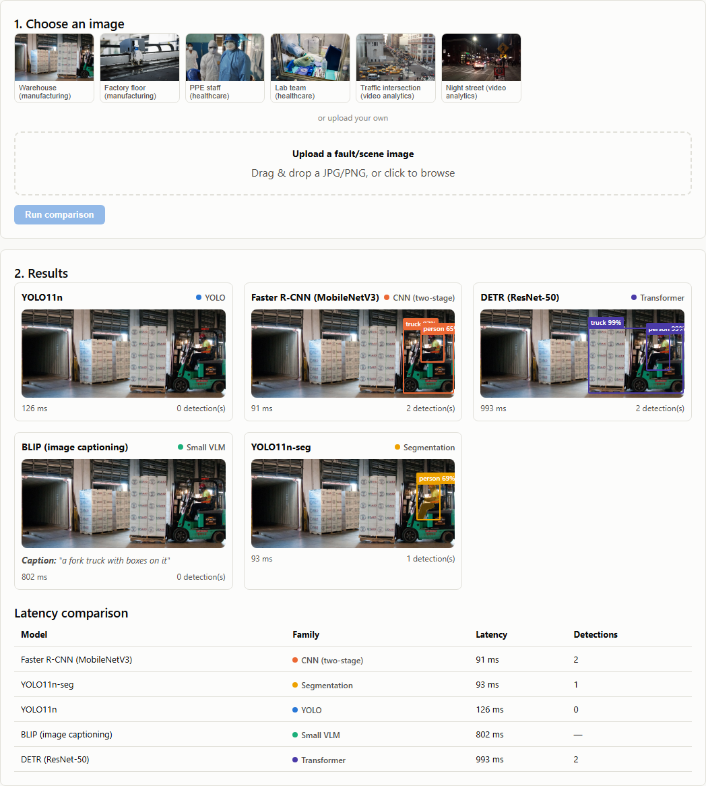
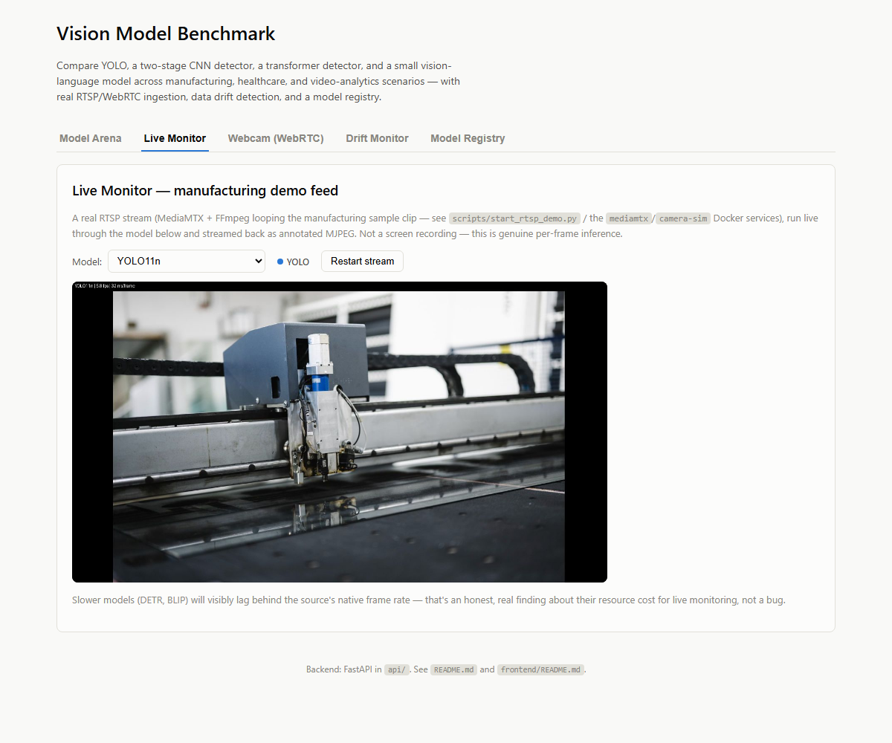
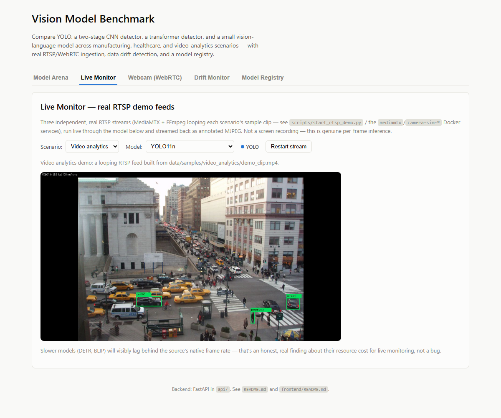
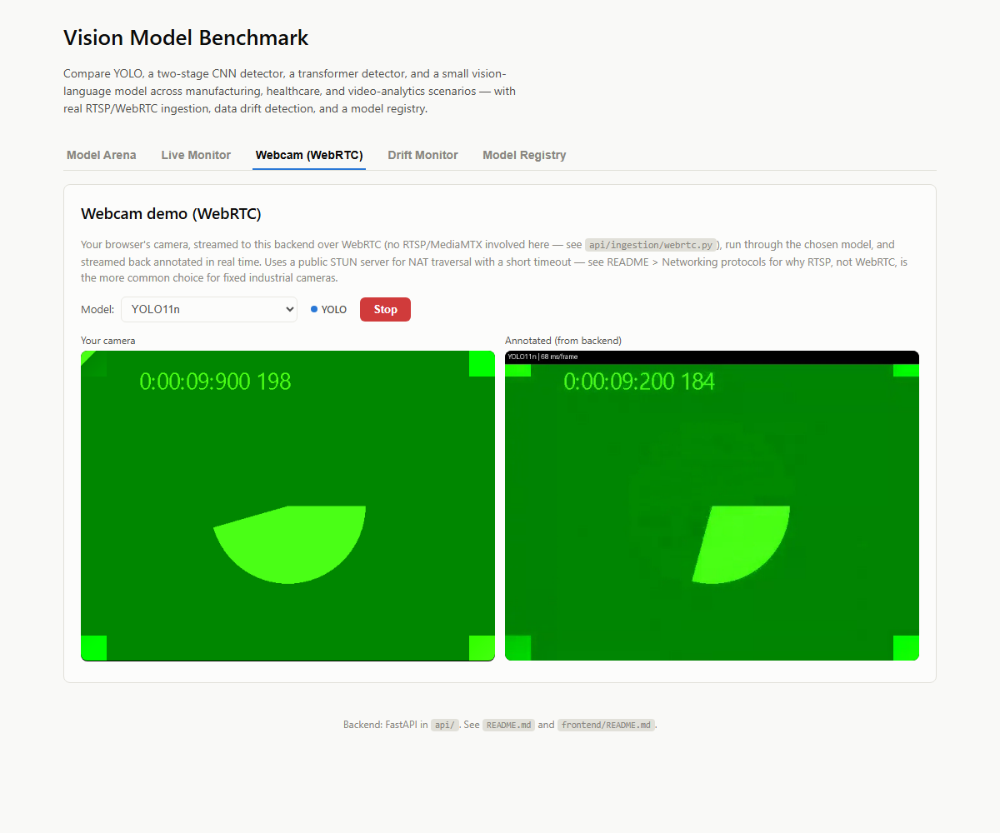
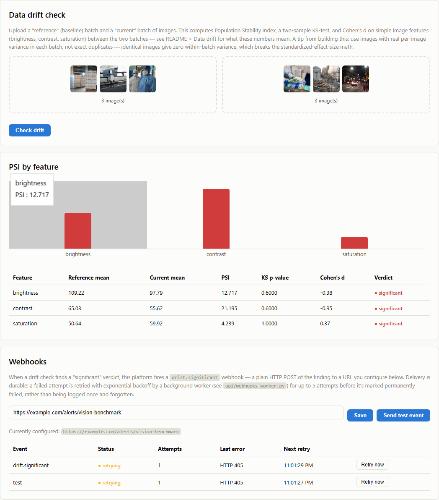
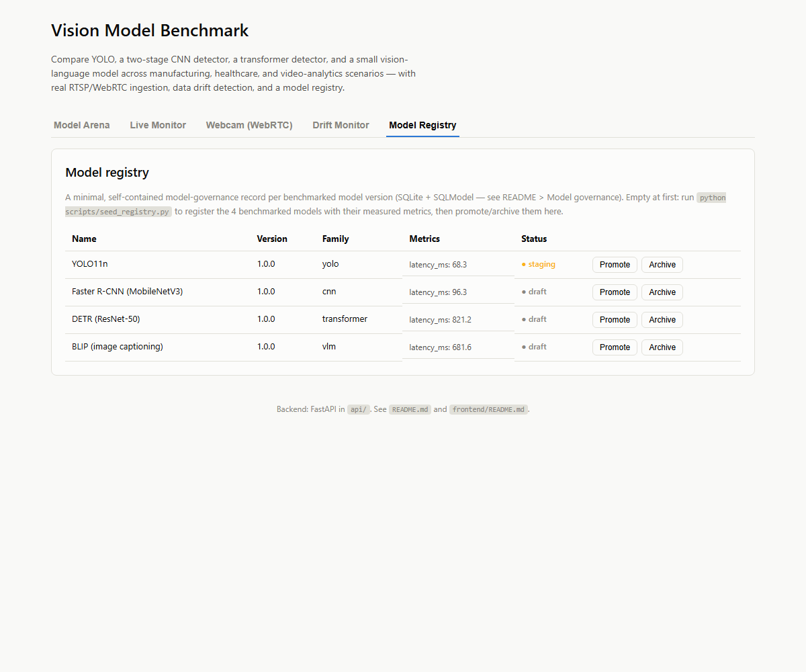
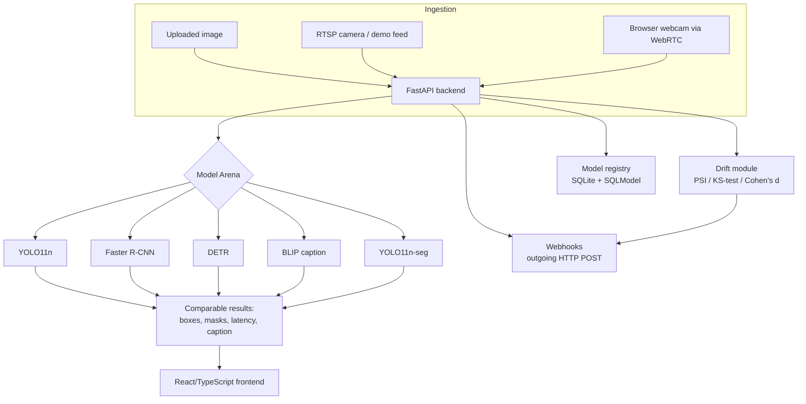

# Vision Model Benchmark: YOLO vs. CNN, Transformer, and Vision-Language Models for Manufacturing, Healthcare, and Video-Analytics Monitoring

A hands-on platform for comparing computer-vision model families side by
side — not just their accuracy on a benchmark dataset, but everything that
actually matters when you deploy one of these on a real production or
clinical line: speed, resource cost, how they fail, and how you'd actually
get video into them in the first place (cameras, codecs, and networking
protocols). It comes with a REST API, a React/TypeScript dashboard suite,
real RTSP and WebRTC video ingestion, data-drift detection, and a model
registry — everything wired together and verified working, not just
described.

This README is intentionally long and written in plain English on purpose:
it's meant to double as a tutorial for an engineer who has never worked with
one of these model families, or never had to think about RTSP vs. WebRTC,
before opening this repo.

---

## Results at a glance

Every screenshot below is the real, running app — not a mockup. Five
models, one uploaded warehouse photo, run side by side:



Notice something real in that screenshot: **YOLO found zero objects** in
this particular frame at its default confidence threshold, while the
two-stage detector and the transformer both found the forklift and the
worker. That's not a cherry-picked failure — it's an honest, reproducible
finding about a real tradeoff (see [Model families](#model-families-what-are-you-actually-comparing)).

A live RTSP camera feed, run through a chosen model in real time — one of
three independent scenario feeds you can switch between:




Your own browser camera, streamed to the backend over WebRTC and annotated
in real time:



Data-drift detection on two image batches, plus the durable webhook
delivery history it fires into (note the `drift.significant` row — that's
a real automatic alert from the drift check above it, not staged separately):



A minimal model registry with a promotion workflow:



---

## Table of contents

- [Why this exists](#why-this-exists)
- [Architecture](#architecture)
- [Model families: what are you actually comparing?](#model-families-what-are-you-actually-comparing)
- [Quickstart](#quickstart)
- [Cameras](#cameras)
- [Video codecs](#video-codecs)
- [Networking protocols](#networking-protocols)
- [The three scenarios](#the-three-scenarios)
- [Data drift](#data-drift)
- [Model registry & governance](#model-registry--governance)
- [Automation quality: what CI actually checks](#automation-quality-what-ci-actually-checks)
- [Extensibility](#extensibility)
- [Known limitations & honest scoping](#known-limitations--honest-scoping)
- [Roadmap](#roadmap)
- [Repository structure](#repository-structure)
- [License](#license)

---

## Why this exists

If you've ever had to answer "which computer vision model should we use for
this camera feed?" you've probably found that most comparisons online stop
at accuracy numbers on a benchmark dataset like COCO. That's useful, but
it's not the whole decision. In a real deployment you also need to know:

- How fast does it actually run on the hardware you have — not a GPU
  cluster, but the edge box or server you're actually going to buy?
- What does it do when it's uncertain? Miss the object entirely, or flag it
  with low confidence?
- How do you even get a camera's video into the model in the first place —
  and what does that cost you in latency, complexity, and vendor lock-in?
- Once it's running, how do you know when it starts seeing something
  different from what it was tuned on?
- Who signed off on this model being in production, and how do you roll it
  back?

This repo answers all of those with working code, using five models chosen
specifically to represent different *design philosophies*, not just
different accuracy/speed points on the same curve.

---

## Architecture



**Backend**: FastAPI (`api/`), Python 3.10. Every model implements one
shared interface (`api/models/base.py`) so the Arena, the Live Monitor, and
the WebRTC path all call the exact same `model.predict(image)` regardless
of which of the five models — or another one you add — is selected.

**Frontend**: React 19 + TypeScript + Vite (`frontend/`), five dashboards
described below, no router or state-management library (five tabs and a
handful of `fetch()` calls don't need either).

**Deployment**: Docker Compose brings up every service (see
[Quickstart](#quickstart)) — the API, the frontend, an RTSP camera
simulator, its own tiny video server, and a TURN server for WebRTC.

---

## Model families: what are you actually comparing?

Five models, spanning the requested families plus one extra dimension
(instance segmentation) added because "where is a rough box around this
object" and "what is this object's exact outline" are genuinely different
questions in a lot of real inspection work — chosen specifically so the
comparison teaches something about *why* each design exists, not just
which one scores higher:

| | YOLO11n | Faster R-CNN (MobileNetV3) | DETR (ResNet-50) | BLIP (image captioning) | YOLO11n-seg |
|---|---|---|---|---|---|
| **Family** | YOLO (single-stage) | Classic CNN (two-stage) | Transformer | Small vision-language model | YOLO (instance segmentation) |
| **How it works** | One forward pass predicts every box directly | First proposes candidate regions, then classifies each one | Frames detection as a set-prediction problem solved end to end by a transformer encoder-decoder | Describes the whole image in a sentence — no boxes at all | Same single-stage architecture as YOLO11n, with an added head that predicts a pixel mask per object |
| **Output** | Boxes + labels + confidence | Boxes + labels + confidence | Boxes + labels + confidence | A caption | Boxes **and** a per-object polygon mask |
| **Measured latency on this repo's dev machine (CPU)** | ~40-130 ms | ~75-100 ms | ~700-900 ms | ~500-800 ms | ~90-130 ms |
| **Download size** | ~6 MB | ~74 MB | ~160 MB | ~990 MB | ~7 MB |
| **Why it's here** | The real-time baseline everyone compares against | Shows the two-stage vs. one-stage design tradeoff directly | Shows what "no hand-designed post-processing" costs in latency | Shows what a fundamentally different *output type* looks like, and what it costs | Shows that "detection" and "segmentation" are different tasks with almost the same latency cost here — worth knowing before assuming a box is good enough |

Run `python scripts/seed_registry.py` against a running API to get these
numbers measured on *your* hardware instead of trusting the table above.

### The honest finding this repo surfaced while being built

While testing this repo against a real warehouse photo (see
[Results at a glance](#results-at-a-glance)), YOLO11n found **zero**
objects at its default 0.5 confidence threshold — no forklift, no worker —
while Faster R-CNN and DETR both found both. This wasn't staged. It's a
real, reproducible consequence of YOLO's speed/recall tradeoff on a
partially-occluded, dimly-lit scene, and it's exactly the kind of thing a
benchmark tool like this should surface rather than hide. Lower YOLO's
confidence threshold (`api/models/yolo_model.py`) and it will likely find
something — at the cost of more false positives elsewhere. That tradeoff,
not a leaderboard number, is the actual decision you're making when you
pick a confidence threshold in production.

### Comparing unlike outputs (the VLM problem)

BLIP doesn't predict boxes, so it can't be scored the same way as the three
detectors. The Arena shows it honestly: a caption, not boxes forced into a
shape they don't have. What *is* comparable is latency and resource
cost — and there, BLIP is squarely in "small VLM" territory: much lighter
than a modern multi-billion-parameter vision-language model, but still far
slower than either single-purpose detector, which is the real, general
lesson about VLMs applied to a task a purpose-built detector already
solves well.

*(A note on scope: this repo was originally going to include Moondream2, a
genuinely tiny 0.5B-parameter VLM with a much better latency profile. While
building this, the only version of it that loads with the standard
`transformers` library turned out to be a 3.7GB+ download — not the small
quantized build its own announcement describes, which is only distributed
in a different, GGUF-based runtime. BLIP was swapped in instead so the
whole repo stays a "clone and run" experience without a multi-gigabyte
download. See [Extensibility](#extensibility) if you want to wire in a
different VLM.)*

### Boxes vs. masks (the segmentation entry)

YOLO11n-seg's Arena card draws a filled, semi-transparent polygon —
zoom into it and you'll see it hugs the actual outline of a person or
object, not a rectangle that also covers whatever background is behind
them. That distinction matters in practice: a box around a corroded pipe
section also includes clean pipe on either side of it, so measuring
"percent of the image that's corroded" from a box overstates the damage;
a mask gives you the actual affected area. The tradeoff, visible in the
table above, is that this repo's segmentation and detection models cost
almost the same latency here — so "we only need boxes" is worth actually
checking, not assuming.

---

## Quickstart

### Option A — Docker Compose (recommended: one command, everything included)

```bash
git clone https://github.com/manuelbomi/YOLO-vs-Vision-AI-Model-Benchmark-for-Manufacturing-Healthcare-and-Video-Analytics-Monitoring.git
cd YOLO-vs-Vision-AI-Model-Benchmark-for-Manufacturing-Healthcare-and-Video-Analytics-Monitoring
docker compose up --build
```

Open **http://localhost:3001**.

This brings up seven containers: the API (with all five models' weights
already downloaded at image-build time, so it starts serving immediately
instead of downloading on first request), the React frontend, an RTSP
camera simulator — MediaMTX plus one FFmpeg container per scenario, each
looping that scenario's own bundled demo clip — for the Live Monitor tab,
and a TURN server (`coturn`) for the Webcam tab's WebRTC path.

**Why ports 8010 and 3001, not 8000/3000?** Those are two of the most
common default ports for exactly this kind of app, and this repo was built
and tested on a machine that already had other services running on both —
a completely ordinary situation. Rather than silently fail with a
confusing port-already-in-use error, this repo picks unusual defaults so
`docker compose up` just works. Change them in `docker-compose.yml` if you
prefer.

First build takes a few minutes (downloading ~1.2 GB of model weights
once, baked into the image). After that, `docker compose up` is fast.

### Option B — Native development (no Docker)

```bash
python -m venv .venv
source .venv/bin/activate   # Windows: .venv\Scripts\activate
pip install --extra-index-url https://download.pytorch.org/whl/cpu -r requirements.txt

# Terminal 1: the API
uvicorn api.main:app --reload --port 8000

# Terminal 2: the frontend
cd frontend
npm install
npm run dev
```

Open the URL Vite prints (typically http://localhost:5173).

For the Live Monitor tab, you also need a local RTSP feed. Install
[MediaMTX](https://github.com/bluenviron/mediamtx/releases) (a single
binary, no install step) and FFmpeg (`winget install Gyan.FFmpeg` /
`apt install ffmpeg` / `brew install ffmpeg`), then:

```bash
python scripts/start_rtsp_demo.py
```

To populate the Model Registry tab with real measured metrics:

```bash
python scripts/seed_registry.py
```

### Verifying it worked

```bash
curl http://localhost:8000/api/health
# {"status":"ok","models_ready":true,"models_loaded":4}
```

Every dashboard in this README was verified against a real running stack
with a headless-browser test before being committed — see the commit
history for exactly what was checked at each stage.

---

## Cameras

The right camera for this kind of system depends entirely on what you're
trying to see, and it's the first decision that constrains everything
downstream.

| Type | How it works | Good for | Not so good for |
|---|---|---|---|
| **Standard RGB (visible light)** | Ordinary color sensor, like a webcam or a phone camera | General object/person/vehicle detection in normal lighting — everything this repo's 5 models were trained for | Low light, smoke/steam, seeing through packaging |
| **Monochrome / global-shutter** | No color filter array; the whole sensor exposes at the same instant | Fast-moving objects (a rolling shutter smears motion into a skewed shape); precise size/shape measurement | Anything that needs true color (label/liquid inspection) |
| **IR / thermal** | Senses heat, not light | Detecting people/animals in the dark, spotting overheating equipment, working through smoke | Fine detail, reading text/labels, color-based sorting |
| **PTZ (pan-tilt-zoom)** | Motorized, remotely aimable | Wide-area monitoring with a human (or software) actively steering it | Feeding a fixed, always-on detection pipeline — a moving field of view breaks per-position tuning |
| **3D depth (stereo, ToF, structured light)** | Two lenses (stereo), a time-of-flight sensor, or a projected light pattern — each recovers *distance*, not just color | Volume/fill-level measurement, precise bin-picking, people-counting that needs to ignore shadows/reflections, distinguishing "close small object" from "far large object" | Cost and complexity — none of this repo's 5 models take depth as input; you'd need a depth-aware model or a separate depth-processing step |

**For this repo specifically**: the bundled sample images and demo video
are ordinary RGB, backlit-appropriate photos — that's what all five
included models expect. If you're building a real deployment around 3D
depth data, the [Extensibility](#extensibility) section below is where
you'd plug in a depth-aware model; the ingestion and dashboard
infrastructure here doesn't care what kind of array a frame came from,
only that `cv2.VideoCapture` (or your own decoder) can hand it a frame.

---

## Video codecs

A codec is how raw video frames get compressed for storage or transmission.
This matters because it directly trades off bandwidth, latency, and image
quality — and because different networking protocols expect different
codecs.

| Codec | Compression | Typical use here | Tradeoff |
|---|---|---|---|
| **H.264 (AVC)** | Very good, mature, hardware-decoded almost everywhere | What this repo's demo RTSP stream and Docker camera simulator actually use | The safe, universal default — every camera, browser, and phone supports it |
| **H.265 (HEVC)** | ~2x better compression than H.264 at the same quality | Bandwidth-constrained deployments (many cameras over a slow uplink) | Licensing costs, and decode support is less universal (especially in browsers without hardware acceleration) |
| **MJPEG** | Each frame is an independent JPEG image — no compression *between* frames | This repo's Live Monitor tab, deliberately: it's simple, has no decoder state to manage, and every browser can display it with a plain `` tag | Much larger bandwidth than H.264/H.265 for the same quality — never used for long-term recording or bandwidth-limited links |
| **AV1** | Best-in-class compression, royalty-free | Newer streaming platforms, YouTube | Highest encode cost (CPU-intensive to produce), least universal hardware decode support today |

**Why this repo uses two different codecs in two different places**: the
RTSP demo feed is H.264 (what a real IP camera would send), but the Live
Monitor dashboard re-encodes each annotated frame as MJPEG to stream to the
browser (`api/routes_live.py`). That's a deliberate, honest choice: H.264
needs a stateful decoder and a signaling/negotiation step to display in a
browser without a plugin, while MJPEG is just "a sequence of JPEGs a
browser already knows how to display" — the right tradeoff for a
low-effort *preview* stream, wrong for anything bandwidth-sensitive or
long-running.

---

## Networking protocols

This is usually the part of a computer-vision project that gets the least
attention until it becomes the hardest part. Three protocols are actually
implemented and verified working in this repo — not just described —
plus a few more worth knowing about.

| Protocol | What it's for | Implemented here? | Pros | Cons |
|---|---|---|---|---|
| **RTSP** (Real-Time Streaming Protocol) | The standard way almost every fixed IP camera streams video | **Yes** — `api/ingestion/video_source.py`, verified against a real local MediaMTX server | Universal camera support, simple (`cv2.VideoCapture("rtsp://...")` and you're reading frames), works well for a single fixed viewer | Not designed for browsers directly (no native browser RTSP support) or for many simultaneous low-latency viewers |
| **WebRTC** | Real-time browser-to-server (or peer-to-peer) audio/video, the technology behind video calls | **Yes** — `api/ingestion/webrtc.py`, verified with a real Chromium browser test (offer/answer exchange, live annotated video received back) | Works natively in every browser with no plugin, sub-second latency, built-in NAT traversal via STUN/TURN | More moving parts (signaling, ICE negotiation), and — the practical reason RTSP remains more common for *fixed industrial cameras* specifically — a camera vendor has to build WebRTC support in, whereas RTSP has been a baseline expectation for over a decade |
| **Webhooks** (outgoing HTTP POST) | Push a notification/event to another system when something happens | **Yes** — `api/webhooks.py`, fires automatically on a significant drift finding | Dead simple (any system that can receive an HTTP POST can integrate), no persistent connection needed | Still just plain HTTP with no built-in auth/signing beyond what you add at the receiving end |
| **MQTT** | Lightweight publish/subscribe messaging, common in IoT | Documented only | Very low overhead, good for many small sensors/cameras publishing to a shared broker | Needs a broker (Mosquitto, etc.); this repo's webhook model was simpler for a single-server demo |
| **ONVIF** | A standard for camera *discovery and control* (not video transport itself — it usually negotiates an RTSP stream underneath) | Documented only | Lets you enumerate and configure cameras from different vendors uniformly | Adds a whole separate protocol/library just for camera setup, overkill for a single demo feed |
| **GigE Vision** | An industrial machine-vision standard over Ethernet, common for high-speed line-scan/area-scan cameras | Documented only | Very high bandwidth, precise hardware triggering — the standard choice for fast industrial inspection lines | Specialized hardware (frame grabbers), not a general "camera on my network" protocol |

### How this repo actually uses RTSP, WebRTC, and webhooks

- **RTSP** (`scripts/start_rtsp_demo.py`, or the `mediamtx`/`camera-sim-*`
  Docker services): MediaMTX runs as a real RTSP server, and one FFmpeg
  process per scenario loops that scenario's own demo clip into it as a
  genuine, continuous RTSP feed — the exact same thing a real camera does,
  three independent times over. The **Live Monitor** dashboard reads
  whichever one you pick with plain `cv2.VideoCapture`.
- **WebRTC** (`api/ingestion/webrtc.py`, following the
  [aiortc](https://github.com/aiortc/aiortc) project's own reference
  pattern): the **Webcam** dashboard tab sends your browser's camera to the
  backend over a real `RTCPeerConnection`, the backend runs each frame
  through the chosen model, and sends the annotated video back on a new
  outgoing track. A TURN server (`coturn`, bundled in `docker-compose.yml`)
  is configured alongside the public STUN server, so it also works for
  browsers behind restrictive corporate/mobile NATs where a direct or
  server-reflexive path isn't reachable — the Webcam tab shows which ICE
  candidate types (`host` / `srflx` / `relay`) were actually gathered, so
  you can see the TURN relay get used rather than just take it on faith.
- **Webhooks** (`api/webhooks.py`, `api/webhooks_worker.py`): fired
  automatically on a significant drift finding, and durable — each
  delivery is persisted (see [Model registry & governance](#model-registry--governance)
  for the shared SQLite file), and a failed attempt is retried with
  exponential backoff (~30s, 60s, 120s, 240s) by a background worker
  running inside the same process, for up to 5 attempts before it's
  marked permanently failed. The **Drift Monitor** tab shows the
  delivery history (status, attempt count, last error, next retry time)
  and lets you force an immediate retry once you've fixed the receiving
  endpoint. This is what makes it durable rather than "logged and
  forgotten" — a webhook endpoint that's down for a few minutes during a
  deploy doesn't silently lose events.

---

## The three scenarios

The **Model Arena** works identically for all three — pick a bundled
sample image or upload your own, and every model runs on it. All three also
have their own live, continuous RTSP demo feed in the **Live Monitor**
tab — three genuinely independent streams (MediaMTX + FFmpeg, each looping
that scenario's own sample clip; see `scripts/start_rtsp_demo.py` and the
`camera-sim-*` Docker services), not one feed relabeled three times:

| Scenario | Arena support | Live demo |
|---|---|---|
| **Manufacturing** | Yes — warehouse and factory-floor sample images | Yes — `data/samples/manufacturing/demo_clip.mp4` |
| **Healthcare** | Yes — staged PPE/training-facility sample images (no real patients, no clinical data — see [`data/CREDITS.md`](data/CREDITS.md)) | Yes — `data/samples/healthcare/demo_clip.mp4` |
| **Video analytics** | Yes — street/traffic sample images | Yes — `data/samples/video_analytics/demo_clip.mp4` |

The Webcam (WebRTC) tab works against any scenario's assumptions equally —
it's just whatever your camera happens to be pointed at.

All sample images are real, openly-licensed photos (Wikimedia Commons),
credited with their exact source and license in
[`data/CREDITS.md`](data/CREDITS.md) — not synthetic renders. That matters
here specifically because all five models are pretrained on everyday
photographic objects (COCO classes like "person," "truck," "bottle"), so a
synthetic abstract test image wouldn't give any of them something real to
detect.

---

## Data drift

**Data drift** means the images coming into your model today look
statistically different from the images it was validated against. That's
distinct from **concept drift** (the relationship between an image and the
*correct* answer changes — e.g., a new product SKU looks like an old
"defect") and **prediction drift** (the model's own output distribution
shifts, which can be a symptom of either). This repo's Drift Monitor checks
data drift specifically, on the *inputs*.

### How it works

Upload a "reference" (baseline) batch and a "current" batch of images. For
each of three simple, inspectable image features — brightness, contrast,
and saturation (`api/drift/features.py`) — it computes:

- **Population Stability Index (PSI)**: bins the reference distribution and
  measures how much the current batch's shape has shifted away from it.
  Below 0.1 = no meaningful shift, 0.1–0.25 = moderate, above 0.25 =
  significant. This is the same convention used across the MLOps industry,
  not something invented for this repo.
- **Two-sample Kolmogorov-Smirnov (KS) test**: a p-value below 0.05
  suggests the two batches don't come from the same distribution.
- **Cohen's d**: a standardized mean shift (how many standard deviations
  apart the two batches' averages are).

All three are hand-rolled with plain `numpy`/`scipy` (see
`api/drift/stats.py`) — no external drift-detection library. That's a
deliberate choice: the goal here is that you can read the ~100 lines of
code and understand exactly what number came from where, rather than trust
a black-box report from a heavier tool.

### A real gotcha this repo found (and fixed) while being built

If every image in a batch is identical (or every batch individually has
zero internal variance), Cohen's d divides by zero and PSI has nothing to
bin — both can silently report "no drift" even when the two *batches*
obviously differ from each other. This is exactly the kind of thing that
looks fine in a demo and bites you in production with real, naturally
low-variance data (e.g., a fixed camera on a very stable scene). The fix
(`api/drift/stats.py`): when both batches individually have near-zero
variance, the API falls back to a plain relative-mean-shift check and
flags the result with `low_variance_warning: true` — shown in the frontend
as "significant ⚠ low-variance fallback" — rather than presenting a
degraded signal with the same confidence as the real statistics.

**Practical tip**: use batches with genuine per-image variation, not
repeated copies of the same file or frame — which is exactly what a real
production monitoring window naturally has anyway.

### Automatic alerting

When any feature comes back "significant," the API automatically fires a
webhook (see [Networking protocols](#networking-protocols) above) with the
event type `drift.significant`. Configure the URL via
`POST /api/webhooks/config`.

---

## Model registry & governance

**Model governance**, in plain terms, means having an answer to "which
version of which model is running in production right now, who approved
it, and what were its measured numbers when it was approved?" — the kind of
accountability an auditor or a new team member should be able to get
without asking around.

This repo's registry (`api/registry/`) is deliberately minimal — SQLite +
[SQLModel](https://sqlmodel.tiangolo.com/), no external database server,
no MLflow tracking server. That's a real, stated scope limit, not a hidden
one: SQLite is single-writer, so this is a demo/reference implementation
for a single-user or small-team tool, not a multi-team production
governance system. Swapping the SQLite URL for a Postgres one
(`api/registry/db.py`) is a config change, not a rewrite, if you outgrow
that.

**The workflow**: every registered model version has an
`approval_status`: `draft → staging → approved → archived`. `POST
/api/registry/models/{id}/promote` advances it one step (idempotent once
approved); `POST /api/registry/models/{id}/archive` retires it. The Model
Registry dashboard shows this with a status badge and one-click
promote/archive buttons.

`scripts/seed_registry.py` measures each of the five models' actual
latency *on the machine it's run on* and registers them with real numbers
— not hardcoded placeholders — so what you see in the Registry tab is
always true for your own hardware.

---

## Automation quality: what CI actually checks

"Automation quality" here means: what stops a broken change from reaching
`main`? `.github/workflows/ci.yml` runs three jobs on every push:

1. **`api`** — installs the Python dependencies and runs the full test
   suite (`pytest`), which includes a smoke test that loads all five
   models and runs inference on a real image (catches install/API-breakage
   regressions — this caught a real `transformers` version-compatibility
   bug during development; see the commit history), plus statistical
   correctness tests for the drift module and CRUD/workflow tests for the
   registry.
2. **`frontend`** — type-checks and builds the React app (`tsc -b && vite
   build`).
3. **`docker`** — builds and starts the *entire* Docker Compose stack, waits
   for the API to report ready, hits the Arena endpoint against a real
   bundled sample image, and confirms the frontend is served — the same
   "does `docker compose up` actually work" check a human would do
   manually, run on every push instead of only when someone remembers to.

None of these are aspirational — they're the same commands used to verify
each feature in this README while building it.

---

## Extensibility

### Add a new model to the comparison

Implement the `VisionModel` protocol (`api/models/base.py`):

```python
class MyModel:
    name = "My Model"
    family = "cnn"  # or "yolo" | "transformer" | "vlm" | "segmentation"
    description = "..."
    approx_download_mb = 42

    def predict(self, image) -> PredictionResult:
        # image is a PIL.Image.Image in RGB mode
        ...
        return PredictionResult(
            model_name=self.name, family=self.family,
            latency_ms=..., image_width=image.width, image_height=image.height,
            # `caption="..."` instead of `detections` for a non-detection model,
            # or set `mask=[(x, y), ...]` on a Detection for a per-object polygon
            # (see api/models/yolo_seg_model.py) -- both are optional, additive
            # fields, so a plain box-only model needs neither.
            detections=[...],
        )
```

Add it to `MODEL_CLASSES` in `api/models/loader.py`. That's it — the
Arena, the Live Monitor, the Webcam demo, and the registry seed script all
pick it up automatically with no other changes.

### Point the Live Monitor at a real camera

Set `DEMO_RTSP_URL` (or pass `?source=rtsp://your-camera-ip/stream` to
`/api/live/stream`) to any real RTSP URL. `api/ingestion/video_source.py`
doesn't know or care whether it's reading from the bundled demo feed or a
real camera on your network.

### Swap in a different small VLM

`api/models/caption_model.py` wraps BLIP behind the same interface as
every other model — replace its `__init__`/`predict` with a different
model's loading/inference code (Moondream2's full-size checkpoint, a
different captioning model, etc.) and nothing else in the app needs to
change.

---

## Known limitations & honest scoping

- **The bundled TURN server uses static demo credentials** (`coturn` in
  `docker-compose.yml`, username/password both `vbdemo`) — fine for a demo
  or an internal deployment behind your own firewall, but a public-facing
  deployment should switch coturn to time-limited credentials (its
  `use-auth-secret` mode) rather than reuse a fixed shared secret.
- **Webhook retries run as an in-process background loop, not a real task
  queue.** Fine for one server (see [Model registry & governance](#model-registry--governance)
  for the same single-writer SQLite scoping); a deployment with high
  delivery volume or multiple API replicas would want a real queue
  (Celery/RQ + a broker) instead of a 15s poll loop.
- **The model registry is single-writer (SQLite).** Stated design choice,
  not a bug — see [Model registry & governance](#model-registry--governance).
- **Drift detection uses simple image statistics, not learned embeddings.**
  Brightness/contrast/saturation are easy to explain and verify by eye;
  they won't catch every kind of distribution shift a learned feature
  embedding would. That's the explicit tradeoff for "you can read the code
  and know exactly what's being measured."
- **5 models, not an exhaustive list.** Chosen to represent 5 distinct
  design philosophies clearly, with the plug-in interface designed
  specifically so adding a 6th, 7th, or 10th is a small, contained change
  (see [Extensibility](#extensibility)).

---

## Roadmap

| Feature | Status |
|---|---|
| YOLO, CNN, Transformer, VLM comparison in one Arena | Done |
| Real RTSP ingestion | Done |
| Real WebRTC ingestion | Done |
| Live Monitor (annotated MJPEG) | Done |
| Data drift detection (PSI/KS/Cohen's d) | Done |
| Model registry with promotion workflow | Done |
| Webhooks on significant drift | Done |
| Docker Compose one-command deployment | Done |
| Live camera-feed walkthrough for healthcare & video-analytics scenarios | Done |
| TURN server config for WebRTC across restrictive NATs | Done |
| Durable webhook delivery with retries | Done |
| A 5th model family entry (instance segmentation, YOLO11n-seg) | Done |
| MQTT publish option alongside webhooks | Considering |
| ONVIF camera discovery | Considering |

---

## Repository structure

```
.
├── api/
│   ├── main.py                   # FastAPI app, CORS, static mounts, startup
│   ├── models/                   # the 5 models + the shared VisionModel interface
│   ├── drift/                    # PSI/KS/Cohen's d statistics + routes
│   ├── registry/                 # SQLModel schema + CRUD/promote/archive routes
│   ├── ingestion/                # RTSP (OpenCV) and WebRTC (aiortc) video sources
│   ├── webhooks.py                # outgoing HTTP POST on configurable events, with durable retries
│   ├── webhooks_models.py         # SQLModel schema for persisted deliveries
│   ├── webhooks_worker.py         # background retry loop
│   ├── routes_arena.py            # "run all models on this image"
│   ├── routes_live.py             # annotated MJPEG stream from a live source
│   └── Dockerfile
├── frontend/                      # React + TypeScript, 5 dashboards (see frontend/README.md)
├── data/
│   ├── samples/{manufacturing,healthcare,video_analytics}/  # real, credited sample photos
│   └── CREDITS.md                 # source + license per asset
├── scripts/
│   ├── start_rtsp_demo.py         # native-dev MediaMTX+FFmpeg launcher
│   ├── seed_registry.py           # registers the 5 models with measured metrics
│   └── fetch_commons_image.py     # how the sample images were sourced
├── tests/                          # pytest: drift stats, registry workflow, model smoke tests
├── docker-compose.yml              # api + frontend + mediamtx + camera-sim + coturn
└── .github/workflows/ci.yml        # api tests + frontend build + full-stack Docker smoke test
```

---

## License

MIT — see [LICENSE](LICENSE).

---

Thank you for reading

---

### **AUTHOR'S BACKGROUND**

### Author's Name:  Emmanuel Oyekanlu
```
Skillset:   I have experience spanning several years in data science, software and AI solution design and deployments, data engineering,
high performance computing (GPU, CUDA), machine learning, MLOps, NLP, Agentic-AI and LLM applications, developing scalable enterprise data pipelines,
enterprise solution architecture, architecting enterprise systems data and AI applications, as well as deploying scalable solutions (apps) on-prem and in the cloud.

I can be reached through: manuelbomi@yahoo.com

Website:  http://emmanueloyekanlu.com/
Publications:  https://scholar.google.com/citations?user=S-jTMfkAAAAJ&hl=en
LinkedIn:  https://www.linkedin.com/in/emmanuel-oyekanlu-6ba98616
Github:  https://github.com/manuelbomi

```
[](https://skillicons.dev)
